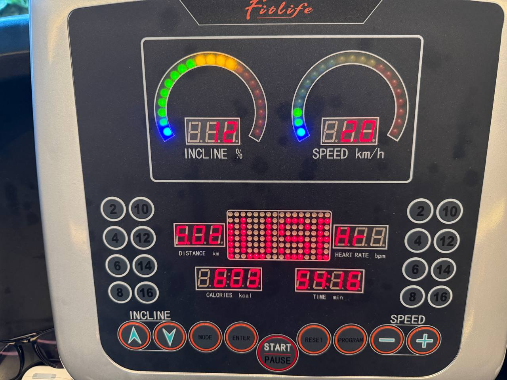

# April 22, 2026

**12:58 PM** — saw it in real time that cuckoo (koel) call does real works

like it rained everytime it created that beautiful ko-el sound
**3:26 PM** — Saw a crow today rethinking his life choices
**3:27 PM**

**3:27 PM** — Did a good 600 kcal burn today ngl feels good
**4:28 PM** — yo! Cuckoo failed today XD, she sang hard but no rain hehe
**7:04 PM** — 25 x Tiki = 600 kcal burn 🔥
**7:04 PM**

**8:17 PM** — At this point I am probably listening tiki tiki almost 100 times a day
**8:33 PM** — I can totally relate to the fact that AI would gonna bring delta +ve effect in the wealth creation 

It’s just that that delta positive doesn’t distributed equally among all

At the same time it also skews down the existing wealth among the hands of the few

Donno why but I think economy would only gonna sustain when we regulate the skewness and prolly bring some enforcement for this distribution of wealth

I know I might sound a little socialist here but tbh that seems like a only valid solution to the problem here

Like just check the number anthropic pre stock val shooted up to 1.7T where does this coming from obviously by shorting other stocks/tokens 

I am not sure but I really think we need to proliferate this concentration

Else we gonna jump into the age of some sort of hyper capitalism
