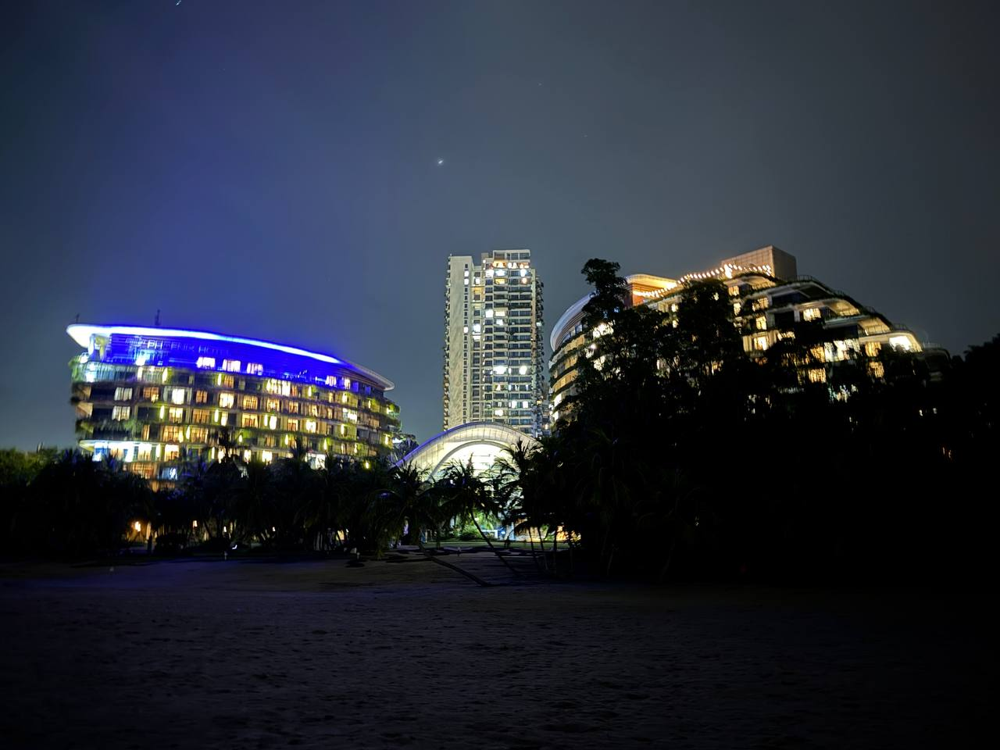

# April 24, 2026

**2:44 PM** — The world is just really small I am right now staying at network school which is 5000km+ away from where I live in Bangalore and coincidently the roommate I got randomly here is the one who just live 800m from my place in Bangalore

Crazy
**2:45 PM** — I have to keep burning atleast 100 gm of fat in a day to get barely visible 6 packs in next 6 months
**7:52 PM** — Had an amazing dinner today finally had biryani with my Russian friend 

Taught him lot about Indian culture

It’s also my final night here in Malaysia 

Although a barren island but in retrospect it’s all good
**7:53 PM**

**7:54 PM** — Got to see the final moon in the midst of this heavy rainy season in the SEA if you know me really well then I am sure you must be knowing what I might be hearing while looking at the moon
**7:55 PM** — Clue: it’s a Bollywood remake of very nice Gujrati garba song
**7:55 PM**

**7:55 PM** — It also reminds me of those 6 letters which I am really obsessed with
**7:57 PM** — Ferdinand said 4th dimension is conscious but I wanna debate him with the proposition that music is really a 4th dimension at it captures an experience/realization/feelings which no other thing can capture or measure
**7:59 PM** — Sand walking at midnight in a foreign country with a little breeze flowing under your earth with cherishing moon light and reliving the moments which are the most sensitive to you 

Undefinable experience
**7:59 PM** — Bummer my flight got cancelled from jhb to kl though
