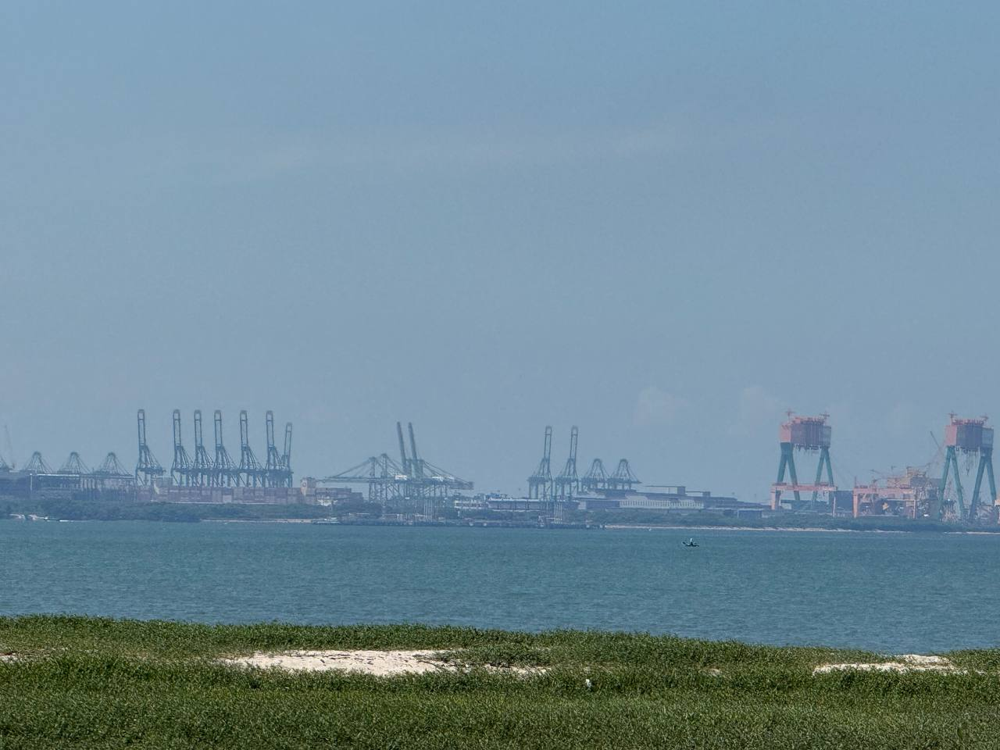
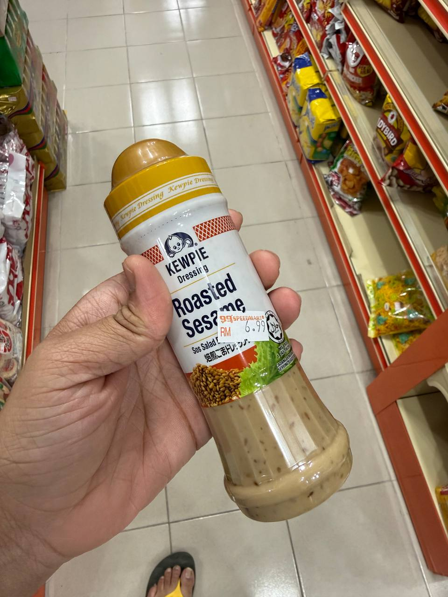
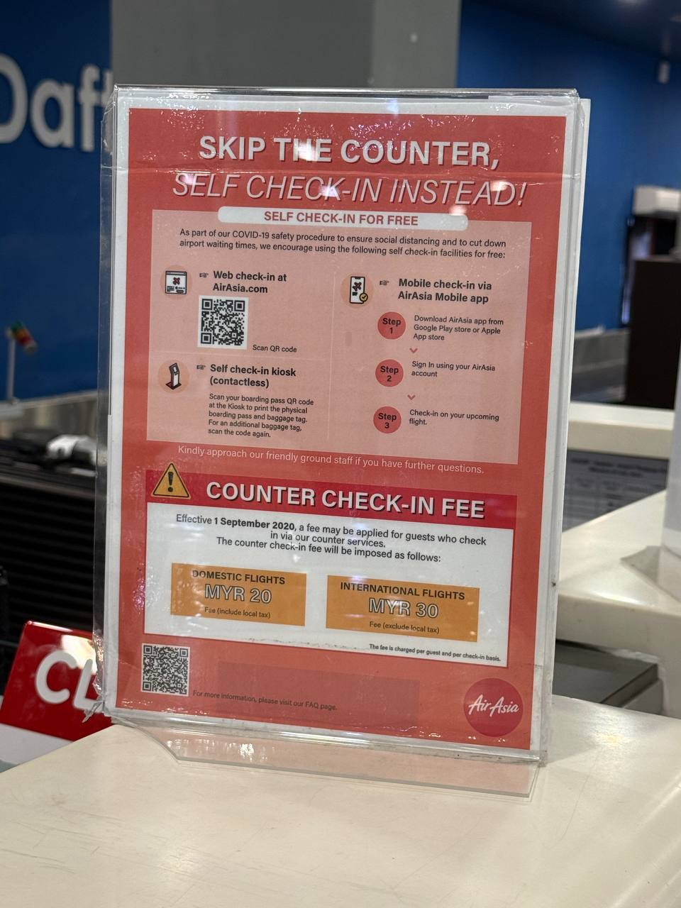
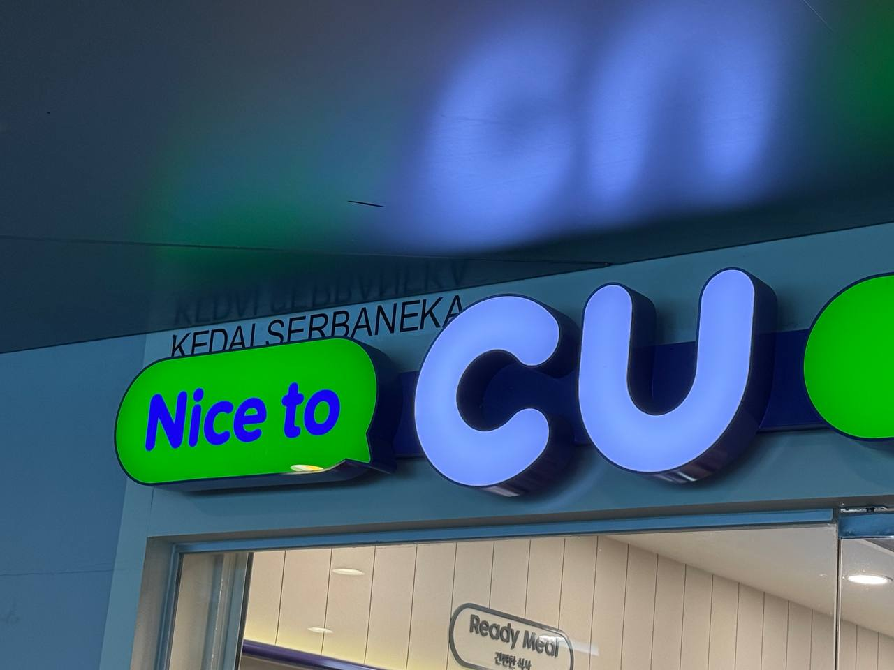
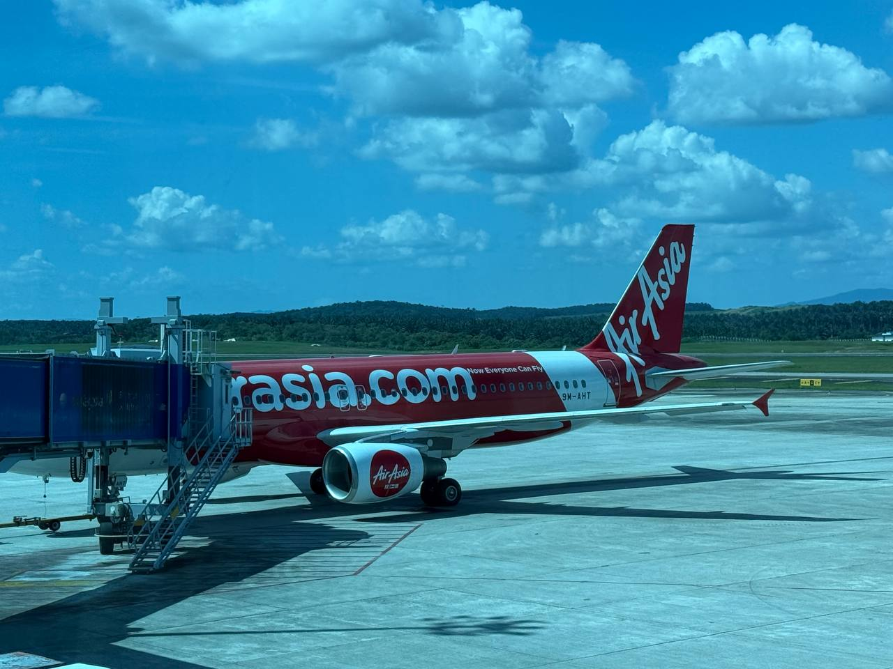
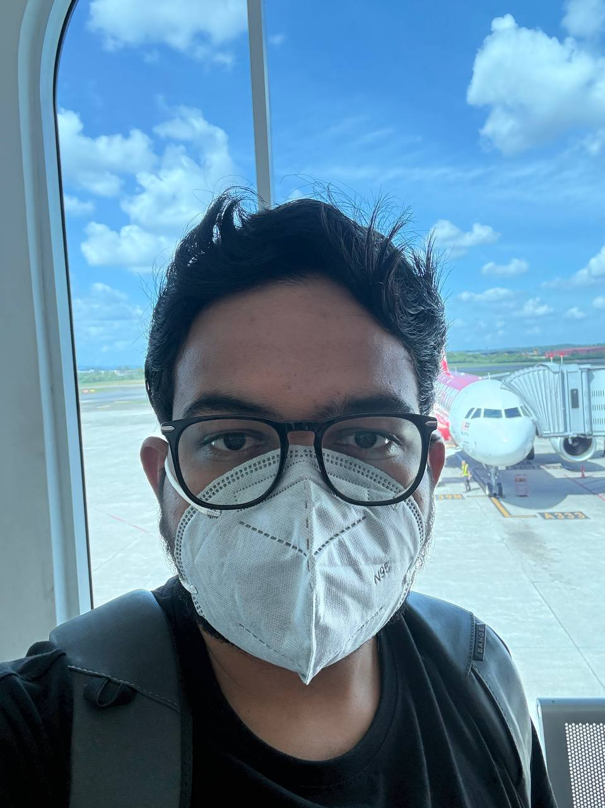
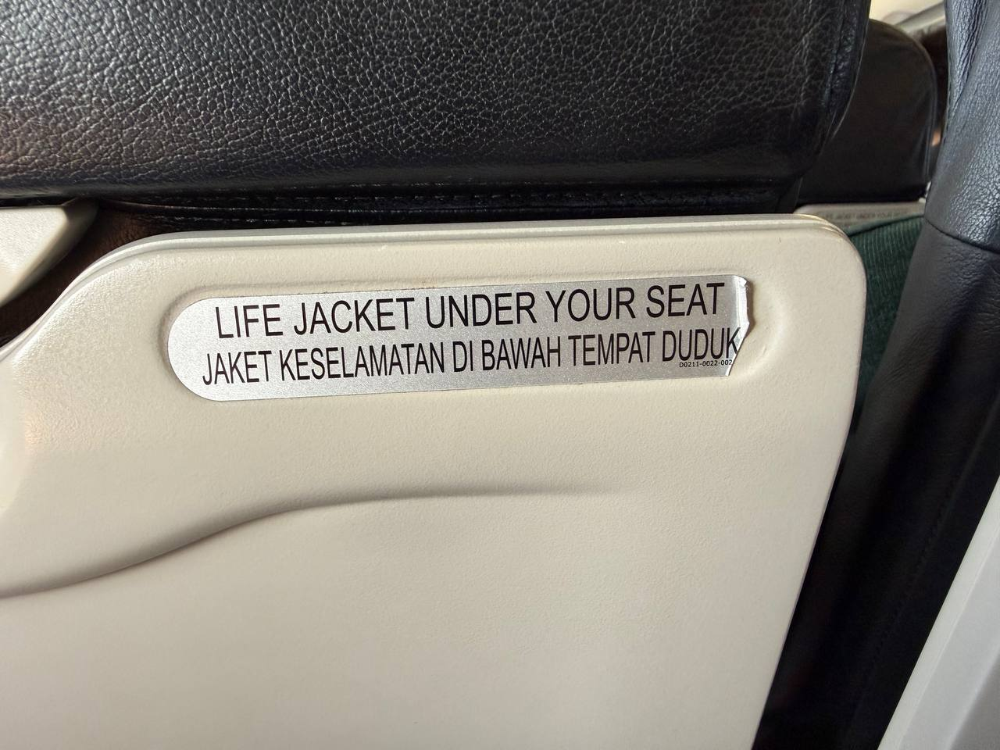
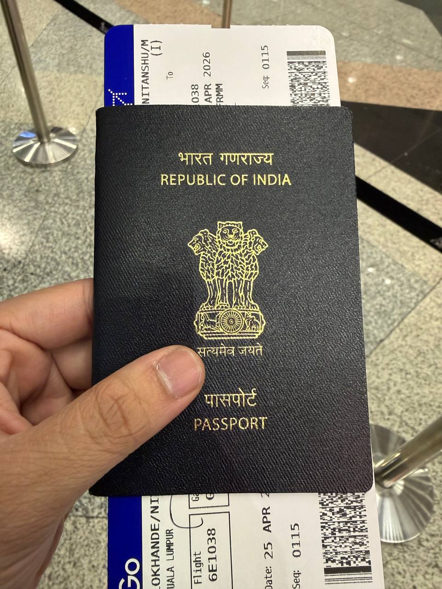

# April 25, 2026

**6:58 AM** — In an absolute sense the probability of you drinking water is same as you succeeding and becoming a billionaire

because you can’t compare infinite with infinite
**7:00 AM** — So when I sit in planes I donno why but I feel like I became the part of the engine, sort of like submerging with planes body 

can’t describe the feeling but yeah felt it with more urban transportation systems
**7:01 AM** — *systems that are huge btw
**8:00 AM**

**8:00 AM** — Reminds me of pearl harbour XD
**10:38 AM** — I don’t travel to reach destination, I travel to travel
**10:43 AM** — I think I should also be able to add songs I am listening while writing these logs
**10:43 AM** — So you readers could get the exact feel while reading
**10:47 AM** — Saw something very interesting it’s roasted sesame seeds

But I p sure these must be very famous among women
**10:47 AM**

**11:20 AM** — This was very interesting so to keep prices low airasia started charging for on counter checking 

Like you can check in for free from their mobile app and kiosk machine 

But if you’re lazy like me and try the counter checkin then you have to pay 20 myr interesting
**11:20 AM**

**11:22 AM** — Very good strategy to get downloads on their app 

Since they already have passenger dominance due to their low prices and all
**11:32 AM** — I really wanna know the discussion which must have happened between the founders before finalising the name and logo
**11:32 AM**

**12:34 PM** — Raising standards very high now for what goes inside my body
**1:00 PM** — For gods sake who approved this livery for air Asia

And that too a permanent livery not occasional
**1:01 PM**

**1:19 PM** — Mask is kinda became a flight essential these days
**1:20 PM** — Indigo should learn from airasia like they’re literally playing starboy and like that’s what people wanna hear

Not you departure and arrival anthem
**1:23 PM** — Me masked air aisa
**1:23 PM**

**2:13 PM** — These torn sticker gave me assurance of a good flight
**2:13 PM**

**4:57 PM** — Say whatever but Indian passports looks very cool 

Rest countries passports looks like going to participate in a lgbtq pride parade XD
**4:57 PM**

**6:13 PM** — Let’s make pringles a staple food
